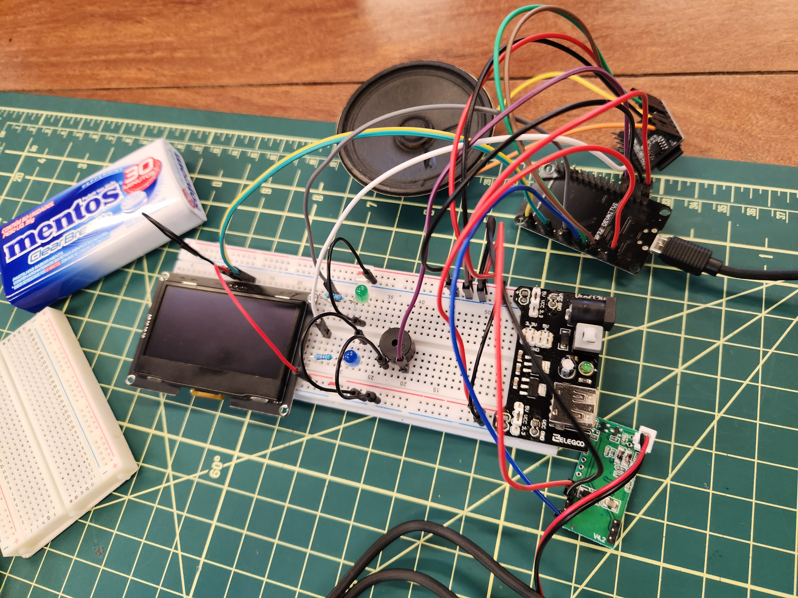

# Project overview

This repo describes the device component of project **CAPIVARA** (**C**ircuito **A**utomatizado **P**or **I**nternet **V**isando o **A**companhamento **R**eal de **A**lunos), developed during the second semester of 2023 for our Interactive Applications Project (INF1039) class. It is an attempt to automate the error-prone and time-consuming task of keeping track of students' attendance by introducing a complete, automated system, which requires minimal interaction. As of December 2023, it is being used by two professors at PUC-Rio.

We started with identifying the problem, by interviewing students and teachers, and understanding the pain points of manually registering attendance with traditional procedures, such as a roll call. Then, we moved on to choosing technologies with the help of our advisor professor, prototyping through several iterations, and finally pitching the solution to an evaluation panel.

The final product consists of a portable device which reads the RFID tag inside each student's university ID card and communicates with our server, as well as a web interface for students and professors with a variety of features:

- Optional notifications for users
- Students can justify their absences
- Setting a time tolerance for arriving late
- Graphical visualization of attendance patterns
- Optional requirement of entry and exit logging
- Interfacing with the university system to export attendance data
- Webhooks for interfacing with other systems, such as a reward program

# Device

Initially, I assembled a prototype with the ESP8266 SoC running the NodeMCU firmware, considering its ease of use and development using Lua. However, as requirements continued to expand, I noticed it lacked a couple of key features, such as the ability to connect to WPA2-Enterprise Wi-Fi networks and TLS support, which made me switch to the ESP32, running the Arduino framework using C++.

Our current device consists of an ESP32-WROOM-32U development board, a variation with support for external antennas, which is necessary for connectivity in some locations. The microcontroller can be powered by a common smartphone Power Bank, and is connected to the following components:

- ~~Green and blue LEDs~~ (removed in final product)
- Active buzzer
- 2.42'' OLED display
- RDM6300 125KHz RFID reader
- ~~DFPlayer Mini amplifier~~ (removed in final product)

## How it works

The device's status is shown at all times in the display, along with unique buzzer beep patterns for different states, ~~and the two LEDs indicating connection status and reader activity~~. In addition, there used to be a speaker module welcoming the students with our professor's voice, but the idea was scrapped after we realized how annoying it was, as well as for simplifying assembly and reducing the size of the device.

Once powered on, it will attempt to connect to a Wi-Fi AP as configured, while also acting as an AP itself for hosting its own configuration webpage. In case the connection is lost, it will warn users and periodically try to reconnect.

After internet connection is established, it will continually check for nearby valid RFID tags. If a tag is detected, an HTTP POST request is sent to our server, containing a hash of the unique tag ID and the classroom where the device is located, which is necessary to resolve possible ambiguities when multiple devices are active. It also expects a response from the server containing the student's name, which is then briefly displayed on the device.

## Dependencies

In addition to ESP32 Dev Module board support and installing drivers for your board's USB-Serial chip, the following libraries must be installed in the Arduino IDE to compile this sketch:

- [RDM6300](https://github.com/arduino12/rdm6300) (RFID Reader)
- [Adafruit SSD1306](https://github.com/adafruit/Adafruit_SSD1306) (OLED Display)
- [ESPAsyncWebServer](https://github.com/dvarrel/ESPAsyncWebSrv) (Web server on AP mode)
- [Preferences](https://github.com/vshymanskyy/Preferences) (Flash memory storage)

## Prototype iterations showcase

 

 

# Team

[**Daniel Kielmanowicz**](https://github.com/danielrjk/capivara) - Back end development

[**Henrique Ribeiro**](https://github.com/henriqueribe/capibararepo) - Front end development

[**Luís Bicalho**](https://github.com/Kirink212) - Advisor professor

[**Miguel Arcanjo**](https://github.com/bathwaterpizza) - Embedded development and system architecture

[**Theo Canuto**](https://github.com/canutoth/projetos_automacao) - Front end development and product identity
